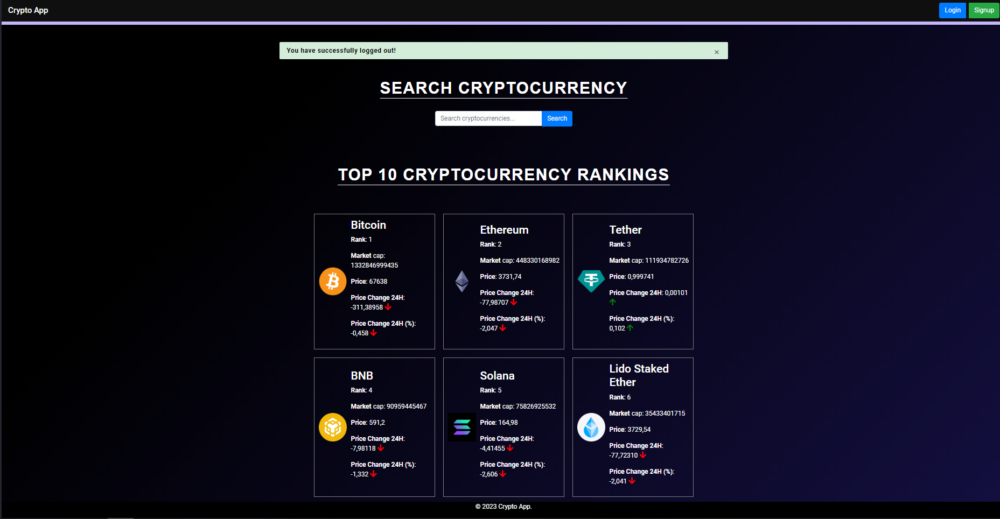

# Django Crypto Portfolio Manager

## Introduction
Welcome to this 3-part technical tutorial series, where we'll be building a Django project that enables users to manage their cryptocurrency portfolios. To implement the functionalities and additional features, we'll be utilizing API calls to CoinGecko or any other cryptocurrency API.

## Part 1: Project Setup and Initial Configuration
In Part 1, we will be defining the functional requirements and give you the overview of what we are building, the approach, the high-level design, and the project setup using Django. We will also configure the `settings.py` file, create the models, and register them in the admin panel.

## Part 2: Templates, Views, and URLs
In Part 2, we will add the templates, views, and URLs, and code up the entire project. This will be the most complex and detailed part of this series.

## Part 3: Testing and Finalization
In Part 3, we will wrap the series up by discussing the testing approach by writing test cases for Models, Views, and Templates using Pytest.

The code for the entirety of the project can be found here: [Github Repo for Django Crypto App](https://github.com/your-repo-link)

This concludes the third and final part of the series. Here we learned how to write tests for our Django project as well as the TDD approach. We saw how to write tests for models, views, and reverse URLs, and wrote over 60 test cases for our project achieving 90%+ test coverage.

This project was a great learning experience for me. I learned a lot about Django, and I also learned how to use the CoinGecko API. I also learned how to use the unittest module to write tests for my Django project. I hope you enjoyed reading this article. If you have any questions or suggestions, feel free to leave a comment below. Thank you for reading! 😊

## Features
- User authentication and authorization
- Cryptocurrency portfolio management
- API integration with CoinGecko for real-time data
- Responsive design using Bootstrap

# to run all tests
python manage.py test

## Database Schema

